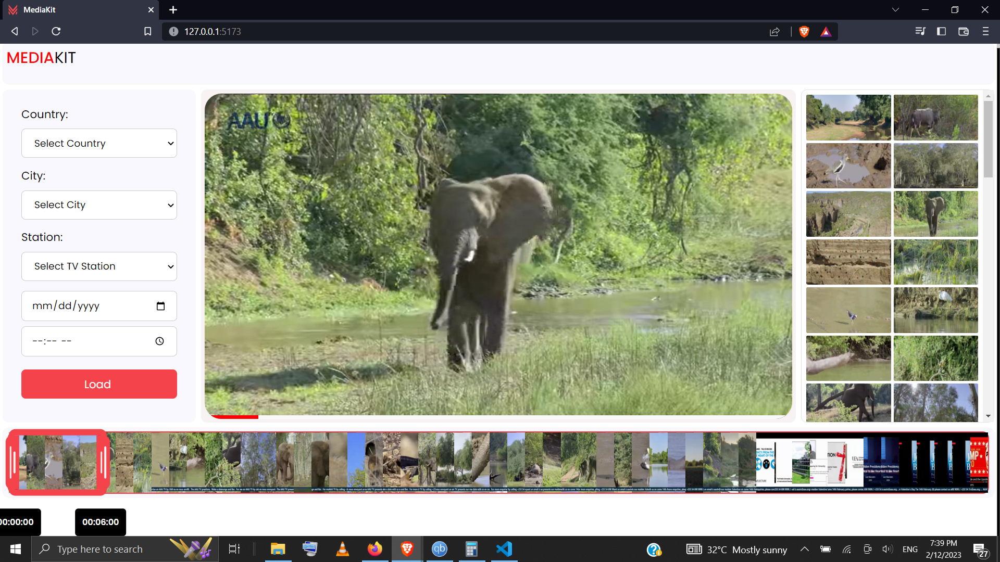

# VIDEO PLAYER & EDITOR

An app for playing and cropping needed parts of a video. 


## Tech Stack

React, CSS, FFMPEG


## Screenshots




## Run Locally

Clone the project

```bash
  git clone https://link-to-project
```

Go to the project directory

```bash
  cd my-project
```

Install dependencies

```bash
  npm install
```

Start the server

```bash
  npm run dev
```

Be sure to enable cross-origin-isolation if you encounter sharedBuffer array not defined issue.
## 🚀 About Me
I'm Coffie Jason, a full stack developer
Reach out to me coffiejasoncj@gmail.com
